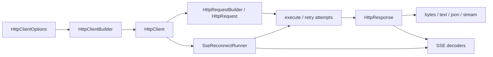

# qubit-http Design

[中文设计文档](design.zh_CN.md) | [User Guide](user_guide.en.md) | [README](../README.md)

This document describes the execution boundaries of `qubit-http` 0.14. The source code and tests define the behavior; this document records the choices that callers and maintainers need to preserve.

## Components and ownership

`HttpClientBuilder` validates `HttpClientOptions` and creates the underlying `reqwest::Client`. A client owns the connection pool, default policy, injectors, interceptors, and a redaction snapshot. `HttpRequestBuilder` captures request-specific values and client defaults into an `HttpRequest`; a send does not borrow mutable client configuration.

## Request and retry boundary

`HttpClient::execute` resolves the request's retry options. Each admitted attempt checks cancellation, applies request interceptors, resolves the URL and effective headers, logs the request, sends it, maps non-2xx status to `HttpError`, then applies response interceptors and response logging. Retry decisions see errors from this whole pre-return attempt. A returned `HttpResponse` is outside the ordinary HTTP retry boundary: later body or SSE read failures belong to the caller.

Retry attempts clone the request. Buffered bodies can be replayed; a deferred streaming-body factory can create a fresh body for each attempt. Retry eligibility is still controlled by method policy, request overrides, and the configured error/status rules. `max_duration` is a continuation budget rather than a hard deadline for an admitted request. Request/connect/header/read timeouts are separate controls. The terminal `HttpError` retains retry diagnostics and the full `RetryError<HttpError>` source chain.

Cancellation is checked before sending and during supported I/O and retry waits. The attempt context routes cancellation ownership so an interceptor's replacement or removal of a token can affect that attempt without incorrectly restoring a stale token on a successful response.

## Response body ownership

`HttpResponse` holds one of three body states: backend response, buffered bytes, or stream taken. `bytes`, `text`, and `json` aggregate within `response_body_size_limit` and cache a successful read. `stream` transfers the backend body to the returned stream; a later aggregate read cannot regain it. A failed read is retained so later reads report the original failure category. The stream path intentionally does not impose the whole-body aggregation limit; SSE line/frame and JSON limits apply to their respective decoders.

Non-2xx responses are converted to errors before the caller receives a response. Error body preview and retained raw error body have separate limits. TRACE body logging can prebuffer a known-size, non-SSE response within its logging limit; unknown-size or larger bodies remain lazy. Request, response, and error diagnostics use the client's redaction policy snapshot.

## SSE decoding and reconnect

Direct `HttpResponse::sse_messages` and `sse_chunks` are body decoders. They enforce line/frame and, for JSON chunks, JSON and completion limits, but do not validate `Content-Type`; callers requiring an SSE media type check `text/event-stream` before decoding. `HttpClient::execute_sse_with_reconnect` does validate that media type.

The reconnect runner opens a response with ordinary HTTP retry disabled, decodes SSE records, tracks the last event ID and server `retry:` delay, and reopens according to `SseReconnectOptions`. It sends `Last-Event-ID` on a later request when available. Cancellation and protocol errors do not reconnect by default. Reconnect budgets include attempts and waits; a configured final delay cap and the SSE one-millisecond minimum are applied by the reconnect policy.

## Invariants to test when changing this design

- A failure after a response is returned must not trigger ordinary HTTP retry.
- A failed body read must retain its error category on subsequent reads.
- A retry must not reuse an already-consumed one-shot upload stream.
- Cancellation token replacement or removal by an interceptor must remain attempt-scoped.
- Direct SSE decoding and automatic reconnect must keep their distinct media-type contracts.
- Logs and error formatting must use the captured redaction policy and bounded body previews.
