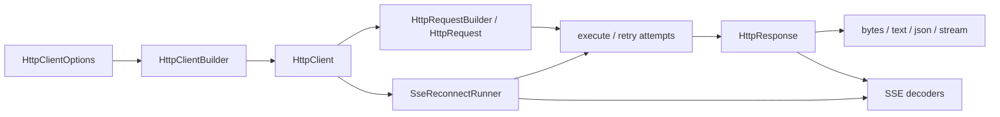

# qubit-http 设计文档

[English Design](design.md) | [用户指南](user_guide.zh_CN.md) | [README](../README.zh_CN.md)

本文记录 `qubit-http` 0.14 的执行边界和必须保持的约束。具体行为以源码和测试为准；这里重点说明调用方和维护者容易误解的设计选择。

## 组件与所有权

`HttpClientBuilder` 校验 `HttpClientOptions`，再构造底层 `reqwest::Client`。客户端持有连接池、默认策略、注入器、拦截器和脱敏策略快照。`HttpRequestBuilder` 将请求级设置与客户端默认值收集到 `HttpRequest`；发送请求时无需借用可变的客户端配置。

`HttpClient::rebuild_with_options` 构造新的后端和脱敏策略快照，同时复制原客户端注册的请求头注入器、请求拦截器和响应拦截器。包括校验失败在内，原客户端始终不变；`to_builder` 则只复制选项。调用方若依赖运行时注册项，应选择保留它们的重建 API。

默认的 `SameOrigin` 策略会以配置的 base URL 校验绝对请求目标，并以初始源校验每次重定向。未配置 base URL 时，可由绝对请求 URL 确定本次请求的初始源。只有显式选择 `AnyOrigin` 才允许跨源目标及重定向。配置读取器接受 `origin_policy = "same_origin"` 或 `"any_origin"`，不支持的值会在构造客户端前报错。

## 请求与重试边界

`HttpClient::execute` 先解析请求的重试选项。每次获准的尝试都会检查取消状态、运行请求拦截器、解析 URL 和最终请求头、记录请求日志、发送请求、将非 2xx 状态映射为 `HttpError`，最后运行响应拦截器并记录响应日志。响应返回前这一整段路径产生的错误可参与重试；`HttpResponse` 返回后的 body 或 SSE 读取错误由调用方处理，不进入普通 HTTP 重试。

每次重试都会克隆请求。缓冲请求体可以重放；延迟生成的流式请求体由工厂为每次尝试重新创建。是否重试仍受 HTTP 方法、请求级覆盖项以及状态码和错误规则限制。`max_duration` 控制是否继续尝试，并非已经开始的请求的硬截止时间；请求、连接、响应头和读取超时分别配置。最终 `HttpError` 保留重试诊断信息和完整的 `RetryError<HttpError>` 错误来源链。

取消状态会在发送前、受支持的 I/O 阶段以及重试等待期间检查。尝试上下文负责令牌归属：拦截器替换或移除取消令牌后，该次尝试按新状态执行，成功响应也不会错误地恢复旧令牌。

## 响应体所有权

`HttpResponse` 的 body 分为后端响应、已缓冲字节和已移交给流三种状态。`bytes`、`text`、`json` 在 `response_body_size_limit` 内聚合数据，成功后缓存；`stream` 将后端 body 移交给返回的流，后续聚合读取不能再取回。读取失败会被记录，后续读取仍报告原先的错误类别。流式读取不受整包聚合上限约束；SSE 行/帧和 JSON 解码各自使用相应限额。

非 2xx 响应会在返回调用方前转换为错误。错误 body 的脱敏预览和保留的原始内容分别受独立限额约束。TRACE 日志只可能预读已知长度、非 SSE 且不超过日志上限的响应；长度未知或更大的 body 保持惰性。请求、响应及错误诊断均使用客户端捕获的脱敏策略快照。

## SSE 解码与自动重连

`HttpResponse::sse_messages` 和 `sse_chunks` 是响应体解码器，执行行/帧限制，以及 JSON chunk 的 JSON 和完成条件限制，但不检查 `Content-Type`。如果上游协议要求 SSE，直接调用者须先校验 `text/event-stream`；`HttpClient::execute_sse_with_reconnect` 会自行校验媒体类型。

重连执行器禁用内层普通 HTTP 重试，打开响应、解码 SSE record、保存最近的事件 ID 和服务端 `retry:` 延迟，然后依照 `SseReconnectOptions` 再次建立连接。有事件 ID 时，后续请求携带 `Last-Event-ID`。取消与协议错误默认不会重连。重连预算覆盖尝试和等待；最终延迟上限及 SSE 的一毫秒最小等待由重连策略处理。

## 修改设计时需要验证的不变量

- 响应已返回后发生的错误不能触发普通 HTTP 重试。
- body 首次读取失败后，后续读取仍保留原错误类别。
- 重试不能重复使用已消费的一次性上传流。
- 拦截器替换或移除取消令牌后的状态只属于对应尝试。
- 直接 SSE 解码与自动重连保持各自的媒体类型契约。
- 日志和错误格式化使用捕获的脱敏策略，并限制 body 预览大小。
- 客户端重建后保留运行时注册项，且不修改原客户端。
- 同源重定向不会连接跨源目标，同时仍遵守重定向次数上限。
